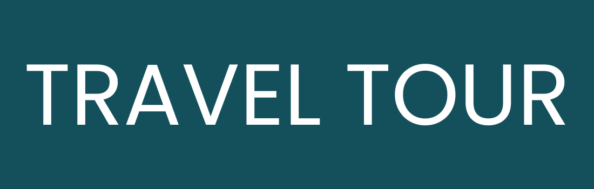

# 🌐 Travel to the Beach

A landing page template for a company that works in beach vacations. scuba diving, and yatch parties.

## Features

- Responsive design across all screen sizes

- Fully functional navigation with smooth scrolling

- Clean, semantic, accessible markup

- Pixel-perfect design

- Soothing reveal and scroll animations

## Running locally

```bash
git clone https://github.com/blue-crown-dev/traveltours.git
cd traveltours
```

- Open the `index.html`file in your browser to see.


## Deployment

## Built with

- HTML
- CSS
- JavaScript
- Remix icons
- Swiper.js
- Scroll reveal.js


  
## Authors

Syed Umair Ali - _Built the project_ - @SyedUmairCodes

## License

This project is licensed with an MIT license.
